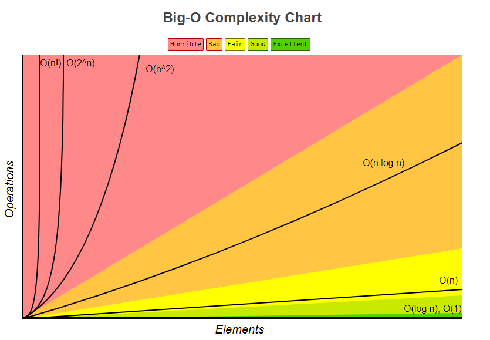

### Big-O
- Describes performance or complexity of an algorithm by measuring the upper bound on asymptotic growth
- Always assumes upper limit or max number of iterations and describes the worst case scenario
- Expressed as rate of growth relative to input size
- [Big-O Algorithm Complexity Cheat Sheet (Know Thy Complexities!) @ericdrowell](http://bigocheatsheet.com/)
- - - -

#### Law of Addition and Multiplication for O()
-  Focus on the dominant terms, dropping non-dominant terms
- `O(n) + O(n + n) = O(n + n^2) = O(n^2)` <- because of dominant terms
	- Applicable for sequential operations
- `O(n) * O(n) = O(n * n) = O(n^2)`
	- Applicable with nested loops
- `f(n) = 7log(n)^3 + 15n^2 + 2n^3 + 8` -> `O(f(n)) = O(n^3)`   <- because of dominant term
- If you have multiple steps, you add up those steps:
	- Step 1 (O(a)) + Step 2 (O(b)) = `O(a+b)`
	- If a == size of input and b == size of input then `O(n+n) = O(2n) = O(n)`
- Constants are dropped -> `O(n+n) = O(2n) = O(n)`
- Different inputs typically result in different variables to represent them in Big-O
- - - -

`n = size of input`

#### Constant Time: O(1)
- Always executes in constant size, regardless of the input size
	-  ex: `x == true`
- Can by applied with loops when the number of iterations is independent from the input

#### Linear Time: O(n)
- Performance grows linearly in direct proportion to the size of the input data set
- Searching a list to see if an element is present
- Iterative and recursive factorial implementations should fall in this category
- O(nm) -> iterating over all cells in a matrix of size n by m
```python
i = 0
while i < n:
	i += 1
# f(n) = n
# O(f(n)) = O(n)

i = 0
while i < n:
	i = i + 3
# f(n) = n/3
# O(f(n)) = O(n)
```

#### Quadratic Time: O(n^2)
- Performance directly proportional to the square size of input
- Examples: Bubble Sort, Insertion Sort
```python
for i in range(0,len(n)):
	for j in range(0, len(n)):
		print(i*j)
# f(n) = n*n = n^2
# O(f(n)) = O(n^2)

for i in range(0,len(n)):
	for j in range(i, len(n)):
		print(i*j)
# Here, the inner loop becomes (n) + (n-1) + (n-2) + (n-3)...
# and becomes n(n+1)/2 so O(n(n+1)/2) = O(n^2/2 + n/2) = O(n^2)

i = 0
while i < n:
	j = 0
	while j < 3*n:
		j += 1
	j = 0
	while j < 2*n:
		j += 1
	i += 1
# f(n) = n * (3n * 2n) = 5n^2
# O(f(n)) = O(n^2)
```

#### Exponential Time: O(2^n)
- Growth doubles with each additional input
	-  Exponential grows -> starts shallow and grows very quickly
- Recursive functions where theres more than one recursive call for each side of problem
- Example: Finding all subsets of a set

#### Logarithmic Time: O(log n)
- Logarithmic growth or iterative halving of data set with each iteration
	- Doubling the size of an input does little to cause growth after the first iteration
- Size of input is reduced by a constant factor at each step
- Examples: Binary Search, Bisection search
```python
# Assumes n is a sorted array and we want to find a value
low = 0
high = len(n)
while low <= high:
	mid = (low + high) / 2
	if n[mid] == value:
		return value
	elif n[mid < value:
		low = mid + 1
	elif n[mid] > value:
		high = mid - 1
# Each iteration discards half of n
# O(log n)
```

#### Log-Linear Time: O(n * log n)
- The result of performing an O(log n) operation n times
- Examples: Merge Sort, Quick Sort, and many more

#### Polynomial Time: O(n^c)
```python
i = 0
while i < 3*n:
	j = 10
	while j <= 50:
		j +=1
	j = 0
	while j < n * n * n:
		j += 2
	i += 1

# f(n) = 3n * (40 + (n^3)/2) = 3n/40 + (3n^4)/2
# O(f(n)) = O(n^4)
```

#### Factorial Time: O(n!)
- Example: Find all permutations of a string

#### Cubic Time: O(n^3)
- - - -


